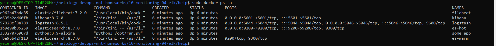

# Домашнее задание к занятию 15 «Система сбора логов Elastic Stack»

## Дополнительные ссылки

При выполнении задания используйте дополнительные ресурсы:

- [поднимаем elk в docker](https://www.elastic.co/guide/en/elastic-stack-get-started/current/get-started-docker.html);
- [поднимаем elk в docker с filebeat и docker-логами](https://www.sarulabs.com/post/5/2019-08-12/sending-docker-logs-to-elasticsearch-and-kibana-with-filebeat.html);
- [конфигурируем logstash](https://www.elastic.co/guide/en/logstash/current/configuration.html);
- [плагины filter для logstash](https://www.elastic.co/guide/en/logstash/current/filter-plugins.html);
- [конфигурируем filebeat](https://www.elastic.co/guide/en/beats/libbeat/5.3/config-file-format.html);
- [привязываем индексы из elastic в kibana](https://www.elastic.co/guide/en/kibana/current/index-patterns.html);
- [как просматривать логи в kibana](https://www.elastic.co/guide/en/kibana/current/discover.html);
- [решение ошибки increase vm.max_map_count elasticsearch](https://stackoverflow.com/questions/42889241/how-to-increase-vm-max-map-count).

В процессе выполнения в зависимости от системы могут также возникнуть не указанные здесь проблемы.

Используйте output stdout filebeat/kibana и api elasticsearch для изучения корня проблемы и её устранения.

## Задание повышенной сложности

Не используйте директорию [help](./help) при выполнении домашнего задания.

## Задание 1

Вам необходимо поднять в докере и связать между собой:

- elasticsearch (hot и warm ноды);
- logstash;
- kibana;
- filebeat.

Logstash следует сконфигурировать для приёма по tcp json-сообщений.

Filebeat следует сконфигурировать для отправки логов docker вашей системы в logstash.

В директории [help](./help) находится манифест docker-compose и конфигурации filebeat/logstash для быстрого 
выполнения этого задания.

Результатом выполнения задания должны быть:

- скриншот `docker ps` через 5 минут после старта всех контейнеров (их должно быть 5);
#### Ответ

- скриншот интерфейса kibana;
- #### Ответ

- docker-compose манифест (если вы не использовали директорию help);
- ваши yml-конфигурации для стека (если вы не использовали директорию help).

## Задание 2

Перейдите в меню [создания index-patterns  в kibana](http://localhost:5601/app/management/kibana/indexPatterns/create) и создайте несколько index-patterns из имеющихся.


Перейдите в меню просмотра логов в kibana (Discover) и самостоятельно изучите, как отображаются логи и как производить поиск по логам.

В манифесте директории help также приведенно dummy-приложение, которое генерирует рандомные события в stdout-контейнера.
Эти логи должны порождать индекс logstash-* в elasticsearch. Если этого индекса нет — воспользуйтесь советами и источниками из раздела «Дополнительные ссылки» этого задания.

### Комментарии/вопрос
Не получается настроить генерацию логов, возникает ошибка с кодеком. Как можно узнать кодировку сообщений или есть еще какой способ обойти эту ошибку:
```
[2023-07-27T02:09:15,340][ERROR][logstash.outputs.elasticsearch] Failed to install template. {:message=>"Template file '' could not be found!", :class=>"ArgumentError", :backtrace=>["/usr/share/logstash/vendor/bundle/jruby/2.3.0/gems/logstash-output-elasticsearch-9.2.1-java/lib/logstash/outputs/elasticsearch/template_manager.rb:31:in `read_template_file'", "/usr/share/logstash/vendor/bundle/jruby/2.3.0/gems/logstash-output-elasticsearch-9.2.1-java/lib/logstash/outputs/elasticsearch/template_manager.rb:17:in `get_template'", "/usr/share/logstash/vendor/bundle/jruby/2.3.0/gems/logstash-output-elasticsearch-9.2.1-java/lib/logstash/outputs/elasticsearch/template_manager.rb:7:in `install_template'", "/usr/share/logstash/vendor/bundle/jruby/2.3.0/gems/logstash-output-elasticsearch-9.2.1-java/lib/logstash/outputs/elasticsearch/common.rb:118:in `install_template'", "/usr/share/logstash/vendor/bundle/jruby/2.3.0/gems/logstash-output-elasticsearch-9.2.1-java/lib/logstash/outputs/elasticsearch/common.rb:49:in `block in install_template_after_successful_connection'"]}
[2023-07-27T02:09:15,432][INFO ][logstash.inputs.tcp      ] Automatically switching from json to json_lines codec {:plugin=>"tcp"}
[2023-07-27T02:09:15,478][INFO ][logstash.inputs.tcp      ] Starting tcp input listener {:address=>"0.0.0.0:5046", :ssl_enable=>"false"}
[2023-07-27T02:09:16,294][INFO ][logstash.pipeline        ] Pipeline started successfully {:pipeline_id=>"main", :thread=>"#<Thread:0x144a6473 run>"}
[2023-07-27T02:09:16,415][INFO ][logstash.agent           ] Pipelines running {:count=>1, :running_pipelines=>[:main], :non_running_pipelines=>[]}
[2023-07-27T02:09:17,214][INFO ][logstash.agent           ] Successfully started Logstash API endpoint {:port=>9600}
[2023-07-27T02:10:12,088][WARN ][logstash.codecs.jsonlines] Received an event that has a different character encoding than you configured. {:text=>"2W\\u0000\\u0000\\u0000\\u00032C\\u0000\\u0000\\u0005\\xCAx^\\xCCX\\xCBn\\xE3\\xCA\\u0011U\\u001E\\x8B\\xFB\\u0019J\\xADf\\u0000>\\x9A\\xCD7W7\\x8B;\\t\\x82A\\xE6b\\x90U`@\\xE8GQ\\xEAk\\x92M\\xB0[6\\u0004C\\xF9\\xBE|V\\xD0\\u0014-\\xD9\\u0016\\xED\\xB1Ǟ\\\\{%\\x88\\xA5\\xAAS]\\xC5sN\\x9B\\xFEc\\xB1X\\xFCa\\xB1\\xF8\\xF3\\u007Fo\\xE0g\\xABZ4\\x96\\xB5=T@\\t\\x8D}\\x92\\xFB4\\xFF\\u0017\\xA1\\u0015\\x89\\xAB\\xB8\\fhT\\xFE\\e<\\xF8\\xB9E\\xCB$\\xB3\\f\\xAA\\e\\xE0\\xC8,TP\\xAB\\u000692\\v\\u001E\\xD8]\\x8FP\\xC1Jj\\u0001\\u001E\\\\\\xE1`\\x94<\\xA0\\u0001\\x81\\xBD\\a\\xAA\\xEB\\xB7\\u0016\\xAA\\e\\xB0\\xBB\\u001E\\xA1\\u0002\\xA1;\\xCBT\\x87\\u0003\\xEC=`k\\xEC,T70=\\xACO\\x89\\xB1\\xDF`\\x8B\\u0003kVJB\\u0005\\u0005\\x89J\\u001A%\\xB1_\\xE6L\\xF8IYP\\x9F\\xB3\\xB8\\xF6\\xA3,\\xCFS\\xACk\\u001Ee\\u0011x\\xB0\\xD1\\xC6v\\xACE\\xA8\\x80!M\\xD3$\\xA1\\x92g\\u0011x0fIʬ\\xA6QZ\\xF8QZD~\\\"\\u0019\\xFA\\x9C\\u0016\\xD4\\xCFX\\x96\\u0015\\xB1\\x8Cc\\xCA\\u0019x0\\xD3\\u0006", :expected_charset=>"UTF-8"}
[2023-07-27T02:10:16,448][WARN ][logstash.codecs.jsonlines] JSON parse error, original data now in message field {:error=>#<LogStash::Json::ParserError: Unexpected character ('W' (code 87)): Expected space separating root-level values
 at [Source: (String)"2W\u0000\u0000\u0000\u00032C\u0000\u0000\u0005\xCAx^\xCCX\xCBn\xE3\xCA\u0011U\u001E\x8B\xFB\u0019J\xADf\u0000>\x9A\xCD7W7\x8B;\t\x82A\xE6b\x90U`@\xE8GQ\xEAk\x92M\xB0[6\u0004C\xF9\xBE|V\xD0\u0014-\xD9\u0016\xED\xB1Ç<<U+009E>\\{%\x88\xA5\xAAS]\xC5sN\x9B\xFEc\xB1X\xFCa\xB1\xF8\xF3\u007Fo\xE0g\xABZ4\x96\xB5=T@\t\x8D}\x92\xFB4\xFF\u0017\xA1\u0015\x89\xAB\xB8\fhT\xFE\e<\xF8\xB9E\xCB$\xB3\f\xAA\e\xE0\xC8,TP\xAB\u000692\v\u001E\xD8]\x8FP\xC1Jj\u0001\u001E\\\xE1`\x94î <U+0082><\xA0\u0001\x81\xBD\a\xAA\xEB\xB7\u0016\xAA\e\"[truncated 316 chars]; line: 1, column: 3]>, :data=>"2W\\u0000\\u0000\\u0000\\u00032C\\u0000\\u0000\\u0005\\xCAx^\\xCCX\\xCBn\\xE3\\xCA\\u0011U\\u001E\\x8B\\xFB\\u0019J\\xADf\\u0000>\\x9A\\xCD7W7\\x8B;\\t\\x82A\\xE6b\\x90U`@\\xE8GQ\\xEAk\\x92M\\xB0[6\\u0004C\\xF9\\xBE|V\\xD0\\u0014-\\xD9\\u0016\\xED\\xB1Ǟ\\\\{%\\x88\\xA5\\xAAS]\\xC5sN\\x9B\\xFEc\\xB1X\\xFCa\\xB1\\xF8\\xF3\\u007Fo\\xE0g\\xABZ4\\x96\\xB5=T@\\t\\x8D}\\x92\\xFB4\\xFF\\u0017\\xA1\\u0015\\x89\\xAB\\xB8\\fhT\\xFE\\e<\\xF8\\xB9E\\xCB$\\xB3\\f\\xAA\\e\\xE0\\xC8,TP\\xAB\\u000692\\v\\u001E\\xD8]\\x8FP\\xC1Jj\\u0001\\u001E\\\\\\xE1`\\x94<\\xA0\\u0001\\x81\\xBD\\a\\xAA\\xEB\\xB7\\u0016\\xAA\\e\\xB0\\xBB\\u001E\\xA1\\u0002\\xA1;\\xCBT\\x87\\u0003\\xEC=`k\\xEC,T70=\\xACO\\x89\\xB1\\xDF`\\x8B\\u0003kVJB\\u0005\\u0005\\x89J\\u001A%\\xB1_\\xE6L\\xF8IYP\\x9F\\xB3\\xB8\\xF6\\xA3,\\xCFS\\xACk\\u001Ee\\u0011x\\xB0\\xD1\\xC6v\\xACE\\xA8\\x80!M\\xD3$\\xA1\\x92g\\u0011x0fIʬ\\xA6QZ\\xF8QZD~\\\"\\u0019\\xFA\\x9C\\u0016\\xD4\\xCFX\\x96\\u0015\\xB1\\x8Cc\\xCA\\u0019x0\\xD3\\u0006"}
[2023-07-27T02:10:16,769][WARN ][logstash.codecs.jsonlines] Received an event that has a different character encoding than you configured. {:text=>"\\xE3\\x9A8=\\x89\\u0002\\u0012\\u0010\\xD8{cI\\xF7\\xA8\\x9B)\\xBB\\xF7@\\xE8\\xDB~O1F\\xB7\\xB8b}\\u000F\\u001E4\\x8Cc3\\xA6\\u0016\\xBA]I-.qX\\t\\xDD\\xF6\\xDA\\xE0J\\xE8\\xAEVk\\u007F\\xC3\\xCC\\u0006*\\xC80'4\\xC9PRI\\x98\\u0014%\\xC6T\\x96RR\\x9EF\\u0004I\\u0011\\x97\\xB9 iV$e$\\x92\\\\\\xD4%aqM\\xB1\\x8C\\xB8\\x88\\xE3Bd980s5,S\\u001D\\u000E~\\xB7m\\xB9\\x83\\t\\u0011\\xCCF\\xEA\\u000Eu]C\\u0005\\x9FXcp>\\xA6\\u001F\\xF4o(,T\\xB0\\xC1\\xC6\\xF57Sq\\x8A\\x99\\xBA[\\xB9\\x99\\e\\xA8\\xE0л?\\xF5\\u001E\\xEC\\xDA\\xE6\\xE9\\x9F_\\xEB\\xE1Ru\\xEB\\x95T\\u000Es\\xB8\\xD1-\\x86;l\\xB0caD\\xFCVw\\xCA\\xEAAuk\\x9F$>6\\x97\\xE1\\xE6Q@\\u0006\\x87+%\\xDC\\xCE\\xDC\\u000E\\xA6Q\\x82Y\\xB7ȳ\\r\\xDC]\\u0002Z\\u0006ԍy\\\\\\xAFHҔ\\xD3\\u001A\\u0013\\x91$y\\x922\\x91\\u058C\\x92\\xB4\\xC8I\\xC1xA\\xF3$'QT`Y\\u0012\\xC42\\xE5R\\xD4%\\xC64\\x8DYD3\\u001E\\xA75x\\xA0Z\\xB6F\\xA8\\x8E\\xEB\\xD4(>\\xB0a\\u0017\\xF6;\\xBB\\xD1]\\u0015\\a\\xA5Ϛ^u\\b\\xFB\\xBD\\a\\x8D^\\xBB\\xB5\\xD2um\\xD0B\\x95d\\xC4\\e\\xDF!\\xF7eϬۚ\\xF0\\x8A\\ra\\xA3xx8\\xDF\\xF08o\\u0013\\xBE\\u0016\\xEE\\xAB\\u0013\\xF8\\xBF\\u0019\\xDD\\u0005\\xAE\\t\\u05CC\\xB1\\u0003\\xB2\\xD6M\\xC1J\\u001C\\u0006\\xF0\\xA0Ec\\xD8\\xDA\\r旯_\\xBF|\\xAD\\u0006\\xADm\\xF5\\xE5\\xEF\\xCB\\u007F~\\xF9\\xCB\\xF8\\a\\xFB\\x91\\xD1\\xFE\\xB8X\\xFC\\xF4\\x9Fg0ZZҷ`\\xB4s\\x9Cl\\x8D\\xDD\\xC8\\u0001\\xBC[nv/\\xD8\\xC8\\xD6\\u000F\\xD9h\\xDCٻ4I\\u0018\\xA5$)$e\\xA2\\xA0$\\xCB\\xEA\\x9C\\xD5<\\xA9)\\xE1\\u001CcJ\\x92\\u001C\\xE3\\x8C\\xD6%%Q\\\")\\x91\\u0005\\x95\\x99\\xAB\\xF3\\u0002\\u000E˳Z\\u0016\\xB1\\x90\\xB9 QD\\xD3\\\"-E\\x9EI\\x9E\\xB9\\xBA5)\\u0005\\x8F#N\\xB9\\xE0\\xB2\\u0010B\\xC4E\\x9C$5!\\xA9\\xC4<#<\\x8F\\xEA\\u0012<\\xD0\\xC3z5V\\xF4\\x8D\\xD8`\\xCBVW\\xC2\\xF8\\u0003:b*9\\xCBRYd\\x89`q.dL\\u0005MyY\\u0010\\xC9yB()\\xF3\\x94\\u0016E-\\u001C\\xE6\\u0019^:\\xBE\\u0019\\xF7\\x99\\xF0\\xAC\\u001EߪF\\xFA\\x92Y\\xB7\\x98\\x94D%\\x89I:\\u0017x\\xC0\\xE7ߥ\\vW\\xFA,\\xA1k`;4P\\xC1Z\\xD9͖\\aB\\xB7!6\\xCCX%B79\\u0003\\u001EH4bP\\xFD\\xC8J\\u0015|\\x9Af\\xBA4\\xD8I\\xB3l\\xF4z\\xE9\\xC6l\\x96V/?뵱\\xCCl\\x96zXJ5\\xA0\\xB0\\xCD\\xCE}\\xFF\\xCB!\\xA3A6\\x88M0\\u007F\\u0006\\u00137\\x9F\\xF8\\xFB\\f\\xEC\\u0001\\xE8\\xC6\\xDA\\xDETax}}\\u001DLH\\u0003\\xA1\\xC3~\\xD0r+\\xAC9\\xA0\\u000E\\u001D$\\x87\\u007F.O\\xA3\\u0004v\\xC6\\u001D\\xE1\\xDF~\\xFD|E\\x9F\\x84\\xE3F\\xF3M\\xA98Cz\\x85\\x9D\\xD4N\\e\\xA6\\xC6\\xE7b&Ѿ\\u0003tf1\\xA6C\\xF9^\\xC59u:\\u0001Y~\\x9Ez\\x9F\\xAD\\xF6\\u001C\\x99\\xBD\\xBBR\\xA3\\u0002Ͷ?\\u0018'a\\xB7^l\\xB6\\xD8I\\xFA\\x8EG\\xE0\\xC4\\xEC\\x81\\bM\\u0013>γ\\xCA\\u0003z0?\\u000F\\xCFo\\u007F\\x97\\xB4o.\\xA0\\xC1+l.\\xA0\\xBA\\u0000\\u001C\\u0006=\\\\\\x80w\\u0001G\\xE39~?g=\\u001DQ\\x8F\\xA1\\x825\\r\\u000Ec\\\\\\xAFzlT\\x87\\xA1\\xDE\\xDA~k\\x83\\xB5\\xAE\\\"BƨI&ưOL5(ݺ\\v\\xDDu(\\xAC\\xFBș\\xB8\\xD4u\\xFD\\x81\\x99]'>X\\xD1Wa\\xD8LoI\\x95\\x92$\\xFB\\xF8\\xB1ZJŚ\\xA5\\u0015\\xFD2\\xCAi@I@\\x82t|V\\xDDf:~P\\xBA[\\u000EXo\\r\\xCA\\vػ\\tߗ\\xE1\\x88\\xE4\\xB4|\\x89\\u0010\\xBF\\x96\\x83_\\x9D\\xE0\\xBE\\u0010\\xAB\\xA7,\\xFBw\\ea\\xA7\\xF5Η\\x8C+\\xE1\\x96\\xCA-\\x84S\\xA9o\\xDCC\\xDC2\\xB8\\xE5\\u001DW\\u0001\\xAAG\\u0016\\xE1\\x9E[\\xF8?/\\u0001\\xEC\\u000F>\\xE4O\\x8B\\xC5O\\xBF\\xFE\\x9E>\\xE4\\xC9\\xC1m^pO\\u0019\\xF5u\\xBC\\x95\\xFC\\u0000\\xD9y\\x8A\\u000F\\xCFH\\xFC1\\xB1}{\\x9A>+\\xFD\\x88|\\xCFT>\\xC8\\xD3\\xED=\\xED={\\x9C\\x93(\\u001C\\x85c\\xBE\\x9F\\xB9;\\xE1\\xD9\\t\\x9D\\xB2\\u001D\\u0004a6ٙ\\x9E\\x9D\\xA7y\\x8E\\xFF\\x99\\x81y\\xABˇ\\xE3\\u007F\\xF1ErF\\xFB\\xE6\\xC0=\\xC3E\\xBC\\x95'z\\xA8\\xA63pN/Ϸm\\x93\\xF3i\\xEE\\xD2\\xEB(]\\xBE\\x8D\\xD5\\u007F\\x953x(\\x93\\u0011\\x89_t_}g29َ\\x87FGu\\xB5\\u001Em\\xC9Q\\xD8Fc\\xF2", :expected_charset=>"UTF-8"}
[2023-07-27T02:10:16,777][WARN ][logstash.codecs.jsonlines] JSON parse error, original data now in message field {:error=>#<LogStash::Json::ParserError: Unexpected character ('\' (code 92)): expected a valid value (number, String, array, object, 'true', 'false' or 'null')
```

---

### Как оформить решение задания

Выполненное домашнее задание пришлите в виде ссылки на .md-файл в вашем репозитории.

---

 
