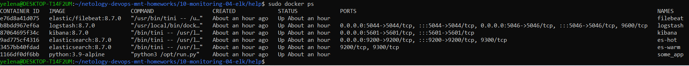

# Домашнее задание к занятию 15 «Система сбора логов Elastic Stack»

## Дополнительные ссылки

При выполнении задания используйте дополнительные ресурсы:

- [поднимаем elk в docker](https://www.elastic.co/guide/en/elastic-stack-get-started/current/get-started-docker.html);
- [поднимаем elk в docker с filebeat и docker-логами](https://www.sarulabs.com/post/5/2019-08-12/sending-docker-logs-to-elasticsearch-and-kibana-with-filebeat.html);
- [конфигурируем logstash](https://www.elastic.co/guide/en/logstash/current/configuration.html);
- [плагины filter для logstash](https://www.elastic.co/guide/en/logstash/current/filter-plugins.html);
- [конфигурируем filebeat](https://www.elastic.co/guide/en/beats/libbeat/5.3/config-file-format.html);
- [привязываем индексы из elastic в kibana](https://www.elastic.co/guide/en/kibana/current/index-patterns.html);
- [как просматривать логи в kibana](https://www.elastic.co/guide/en/kibana/current/discover.html);
- [решение ошибки increase vm.max_map_count elasticsearch](https://stackoverflow.com/questions/42889241/how-to-increase-vm-max-map-count).

В процессе выполнения в зависимости от системы могут также возникнуть не указанные здесь проблемы.

Используйте output stdout filebeat/kibana и api elasticsearch для изучения корня проблемы и её устранения.

## Задание повышенной сложности

Не используйте директорию [help](./help) при выполнении домашнего задания.

## Задание 1

Вам необходимо поднять в докере и связать между собой:

- elasticsearch (hot и warm ноды);
- logstash;
- kibana;
- filebeat.

Logstash следует сконфигурировать для приёма по tcp json-сообщений.

Filebeat следует сконфигурировать для отправки логов docker вашей системы в logstash.

В директории [help](./help) находится манифест docker-compose и конфигурации filebeat/logstash для быстрого 
выполнения этого задания.

Результатом выполнения задания должны быть:

- скриншот `docker ps` через 5 минут после старта всех контейнеров (их должно быть 5);
#### Ответ

- скриншот интерфейса kibana;
- #### Ответ

- docker-compose манифест (если вы не использовали директорию help);
- ваши yml-конфигурации для стека (если вы не использовали директорию help).

## Задание 2

Перейдите в меню [создания index-patterns  в kibana](http://localhost:5601/app/management/kibana/indexPatterns/create) и создайте несколько index-patterns из имеющихся.


Перейдите в меню просмотра логов в kibana (Discover) и самостоятельно изучите, как отображаются логи и как производить поиск по логам.

В манифесте директории help также приведенно dummy-приложение, которое генерирует рандомные события в stdout-контейнера.
Эти логи должны порождать индекс logstash-* в elasticsearch. Если этого индекса нет — воспользуйтесь советами и источниками из раздела «Дополнительные ссылки» этого задания.

### Комментарии/вопрос
Контейнеры были подняты по инструкции первого задания. Но нет логов от logstash. В логах контейнера logstash такие ошибки:

<details>
    <summary>$ sudo docker logs 48137b23d0a9 (logstash:6.5.1)</summary>

```
[2023-07-27T19:02:33,287][WARN ][logstash.codecs.jsonlines] Received an event that has a different character encoding than you configured. {:text=>"2W\\u0000\\u0000\\u0000)2C\\u0000\\u0000(\\u0001x^\\xEC}K\\x93\\xE3\\xC8}'v\\xB7WݳZ\\xED\\xCA/\\xF9mC\\xF0\\xC5V\\xF0\\x81'\\u0001B\\xE1\\bY=\\xD2L\\xCB\\xE3\\u0019\\xC5\\xCCHVhj\\x82\\x91\\u0004\\x92,\\xA8A\\x80\\u0001\\x80]S\\xEA\\xE8\\xB3?\\x83\\xBF\\x85\\u000F\\xBE:l\\x9F\\xEC\\x83þ:\\xC2'\\x87/>\\xFB\\xE2\\x93#\\u001C\\xFF\\xCC\\u0004\\u0012d&@\\x80DUW\\xD5T_\\x9AE&\\u0012\\xF9\\xFC=\\xFE\\x99H\\x98?P\\u0014\\xE5\\u007F(\\xCAW\\xFE\\xFD\\xB5\\xF6\\x9D\\\"\\xDA\\xE0\\xBC@\\x9B\\xAD\\xE6k\\xA6nZc\\xDD\\u001D\\x9B\\xE7;s߶'\\x9E\\xE5\\xFDT\\ei\\xDF\\xD9\\xE0\\u0002\\x85\\xA8@\\x9A\\xFFZ[bTh\\xBE\\xB6\\x8Ab\\xBCĨ\\xD0FZq\\xBDŚ\\xAF-\\xC24\\xD0F\\xDA+\\x9C\\xE5Q\\x9Ah\\xBE\\xE6N̉\\xAE\\xBD\\u0019ih\\x8D\\x93B\\xF3_kQ\\xA8\\xF9Z\\xE0\\x993\\xCB1\\xBC\\xF1\\xDCp\\xBC\\xB1\\xBD\\x9C\\xAD\\xC6K\\v/\\xC7s<\\x9FcC\\xD7-\\eY\\xDAH{\\x85\\xB3<J\\u0013\\xCD\\xD7܉9ѵ\\x91V\\\\o\\xB1\\xE6k\\xAB(\\xC6K\\x8C\\xE0\\xCEx{\\x8978C\\xF1\\x82\\xE4l\\x86\\x96\\xAE\\xEBsg\\x8C\\xB0\\x85ƶk\\xCDǞ\\xE5\\x86c\\xDD^\\xCE\\xD1\\xDC[\\xB9\\xD8s\\xB5\\x91v\\x99\\xE6E\\x826X\\xF3\\xB5\\xB9\\xE1\\x99\\xD8\\fuO\\xB7\\xB0\\xF6f\\xA4\\u0005iR\\xA0(\\xC1\\x99\\xE6\\xBF\\xD6b\\xB4\\xC4q\\xAE\\xF9\\xAF\\xB54[/b\\xB4\\xC4\\xF18\\u000F.\\xF1\\u0006-\\x96\\xBB(\\u000E\\xC7!*\\xB0\\xE6k\\xA6nx\\x86\\xAEϴ\\x91\\u0016\\xA4\\x9BE\\x98\\u0006/q\\xB6\\b\\xD2\\xCD6\\xCD\\xF1\\\"Mp\\xBAZi\\xBE\\xF6}\\u0014\\xE7X\\eii\\xB6^Đu\\x99Y\\u001E\\\\\\xE2\\r\\u001A\\xF3\\x863Hu%y\\u0005)+\\xDE8\\xD9m\\x968\\x83\\xB4\\xF2\\x94\\xDB,\\xFD\\u0019\\u000E", :expected_charset=>"UTF-8"}
...
[2023-07-27T19:05:10,265][WARN ][logstash.codecs.jsonlines] JSON parse error, original data now in message field {:error=>#<LogStash::Json::ParserError: Unexpected character ('W' (code 87)): Expected space separating root-level values
 at [Source: (String)"2W\u0000\u0000\u0001\xA42C\u0000\u0002\x96\x94x^\xEC\xBDkp$\xD7u\u001F\x8E\xFF?N\u0018ǎ\xFC\x8A\xF3y4\xB4\x88]\v\x8F\xEEyu\xF7P|\xF4\x934_\xE2\x9B\"\tj9\u00184\x80\xE1\u00023\xEB\x99\u0001\xB6\x97\xCBM\xA5\"\x97i:\xB6c\xC9QÉ´\u0015)Rb[e%)W\"+\xB6\x92JR\x80\u0014ّd\x95l'\x96RJ\\\xF6\a\u007F\x88S\xC9\xF7|H\xA5\xCE\xEFwzz\x81\xEE\u0001\u0006\xB3\x83\xE5\xEE\u0012\xF8\x80\xEE龏s\xCF=\xF7\xDC{~\xE7\xDCەG\xE6\xE6\xE6\xFE\xBF\xB9\xB9\xF7\xFC\xD9\xD5\xF2\x83\xC3\xCEv<\u0018\xB6\xB6/\x95\x9B\xE5\x8AQ\xA9.\"[truncated 1199 chars]; line: 1, column: 3]>, :data=>"2W\\u0000\\u0000\\u0001\\xA42C\\u0000\\u0002\\x96\\x94x^\\xEC\\xBDkp$\\xD7u\\u001F\\x8E\\xFF?N\\u0018ǎ\\xFC\\x8A\\xF3y4\\xB4\\x88]\\v\\x8F\\xEEyu\\xF7P|\\xF4\\x934_\\xE2\\x9B\\\"\\tj9\\u00184\\x80\\xE1\\u00023\\xEB\\x99\\u0001\\xB6\\x97\\xCBM\\xA5\\\"\\x97i:\\xB6c\\xC9Qɴ\\u0015)Rb[e%)W\\\"+\\xB6\\x92JR\\x80\\u0014ّd\\x95l'\\x96RJ\\\\\\xF6\\a\\u007F\\x88S\\xC9\\xF7|H\\xA5\\xCE\\xEFwzz\\x81\\xEE\\u0001\\u0006\\xB3\\x83\\xE5\\xEE\\u0012\\xF8\\x80\\xEE龏s\\xCF=\\xF7\\xDC{~\\xE7\\xDCەG\\xE6\\xE6\\xE6\\xFE\\xBF\\xB9\\xB9\\xF7\\xFC\\xD9\\xD5\\xF2\\x83\\xC3\\xCEv<\\u0018\\xB6\\xB6/\\x95\\x9B\\xE5\\x8AQ\\xA9.\\u001A\\xD6b\\xC5z\\xD6t\\x9AF\\xA5Y\\xAD.Ul\\xEB\\xA5\\xF2B\\xF9\\xC1\\xEDx\\xD8Zk\\r[\\xE5\\xE6\\xD5\\xF2j\\xDC\\u001A\\x96\\x9B\\xE5\\xF5\\xCEV\\xBC\\u001A\\xB7\\x86\\xE5\\x85\\xF2\\xF0ʥ\\xB8\\xDC,_X\\xEB\\xB5\\xCB\\v\\xE5ݸ?\\xE8\\xF4\\xBA\\xE5f\\xD9Z\\xAA,\\u0019\\xE5k\\v\\xE5\\xC1\\xB0\\u001F\\xB7\\xB6\\xCB\\xCD\\xF2`\\xB8\\xD6\\xDB\\u0019\\x96\\u0017\\xCA\\xDB\\xF1`\\xD0ڈ\\xCB\\xCD\\xF2\\xCB\\u0015\\xA3R=T\\xEFBŶ^y\\xF9\\u0005\\xF7\\xE9'J\\xAF\\xBC\\xBC\\xD5\\xDB\\u0018\\f[\\x83ͥvo-n\\u000F\\x96^\\e\\xF4\\xBA[\\x9Dn<x\\xA5\\xF4t\\u070E;\\xBB\\xF1Z\\xA9\\xD5-ŻqwX\\u001An\\xB6\\x86\\xA5\\xCD֠\\xD4*\\xADu\\xD6\\xD7\\xE3~\\xDC\\u001D\\x96ڛ\\xAD~\\xAB=\\x8C\\xFB\\xA5\\xB8\\xDB\\xEE\\xADu\\xBA\\e\\xA5\\xE1f\\xAB[\\xBA\\xD2\\xDB)\\xB5{\\xDD\\xF5\\xCE\\xC6N?^[*]m\\u000E\\xE3dx\\xDF\\xFD+\\xE5\\xCA\\v++++;\\x86a\\u0018++++;\\x86a\\u0018++++;\\x86a\\u0018\\xE7+\\xFE\\xCA\\xCA\\xCA\\xCA\\xC1\\xB7\\xE7\\xD2tf\\xF2a\\xB9MB\\xFFڣ\\xB8q\\xAA\\xB8\\x84\\xBC\\xF8\\xF6\\xB5\\xF9]<\\xF0\\xAC\\u0017\\xFEۿz\\t\\xB7a\\x80\\x8B\\xEF.\\xE3\\u001A9ۨ!\\x89\\f\\xFC\\xF6\\xEB\\xCF\\xE3\\xAA?ms^~J\\xFD\\xA6'wIh\\xCAe\\xF5\\xC5\\xFB\\xE4\\x92\\u0004\\x95\\xC7p\\xF5\\xF5%*\\xDE1\\f\\xD3\\xE1\\xE3:/\\xFE\\xC3\\xCFo\\xBE\\x86[\\xBB\\x82\\x8B\\x83R\\xA4\\xD8\\u001A\\u007FW\\u0016pum\\u0017W\\e\\xD4\\xC8{$Ll\\xE3\\x95g\\xF0\\\"\\xE4\\xFB\\xD0\\xC6/\\xAF\\xFA\\u0000\\xAE6\\xEAM\\xBC\\x88\\xBFP\\xABd\\xE6o/ln\\xE1\\x85\\xC3\\xDF![lW\\xF7\\xFF]\\u0013\\xCF\\xFD"}
[2023-07-27T19:05:44,754][ERROR][logstash.outputs.elasticsearch] Encountered a retryable error. Will Retry with exponential backoff  {:code=>400, :url=>"http://es-hot:9200/_bulk"}
[2023-07-27T19:06:48,831][ERROR][logstash.outputs.elasticsearch] Encountered a retryable error. Will Retry with exponential backoff  {:code=>400, :url=>"http://es-hot:9200/_bulk"}
...
```

</details>

В логах говориться об ошибке кодировки: expected_charset=>"UTF-8" и есть 400 ошибка (bad request indicates that the request sent to the server is invalid or corrupted)<br />
Была попытка поменять выходной формат в logstash.conf на json и дописать к нему кодировку UTF-8, но это не помогло <br />
Контейнер elk доступен по ссылке из логов:<br />
<details>
    <summary>Внутри контейнера logstash:6.5.1 </summary>
```
bash-4.2$ curl http://es-hot:9200/_bulk
{"error":"Incorrect HTTP method for uri [/_bulk] and method [GET], allowed: [POST, PUT]","status":405}bash-4.2$
bash-4.2$ curl http://es-hot:9200/
{
  "name" : "es-hot",
  "cluster_name" : "es-docker-cluster",
  "cluster_uuid" : "dtCoJmURT4ar-ehJyY_TEQ",
  "version" : {
    "number" : "8.7.0",
    "build_flavor" : "default",
    "build_type" : "docker",
    "build_hash" : "09520b59b6bc1057340b55750186466ea715e30e",
    "build_date" : "2023-03-27T16:31:09.816451435Z",
    "build_snapshot" : false,
    "lucene_version" : "9.5.0",
    "minimum_wire_compatibility_version" : "7.17.0",
    "minimum_index_compatibility_version" : "7.0.0"
  },
  "tagline" : "You Know, for Search"
}
$ sudo docker exec -ti 48137b23d0a9 bash
bash-4.2$ curl http://es-hot:9200/_bulk
{"error":"Incorrect HTTP method for uri [/_bulk] and method [GET], allowed: [POST, PUT]","status":405}bash-4.2$
```

</details>

В ссылках из начала страницы нет информации про кодировку. Также кластер был развернут на Virtual Box Ubuntu ВМ и в 
приложении ubuntu для windows:
<details>
    <summary>$ cat /etc/os-release </summary>
PRETTY_NAME="Ubuntu 22.04.2 LTS"
NAME="Ubuntu"
VERSION_ID="22.04"
VERSION="22.04.2 LTS (Jammy Jellyfish)"
VERSION_CODENAME=jammy
ID=ubuntu
ID_LIKE=debian
HOME_URL="https://www.ubuntu.com/"
SUPPORT_URL="https://help.ubuntu.com/"
BUG_REPORT_URL="https://bugs.launchpad.net/ubuntu/"
PRIVACY_POLICY_URL="https://www.ubuntu.com/legal/terms-and-policies/privacy-policy"
UBUNTU_CODENAME=jammy

</details>

Результат в обоих случаях одинаковый<br />
Не понятно, куда копать дальше, чтобы логи отправлялись с logstash контейнера в elk контейнер <br />


---

### Как оформить решение задания

Выполненное домашнее задание пришлите в виде ссылки на .md-файл в вашем репозитории.

---

 
